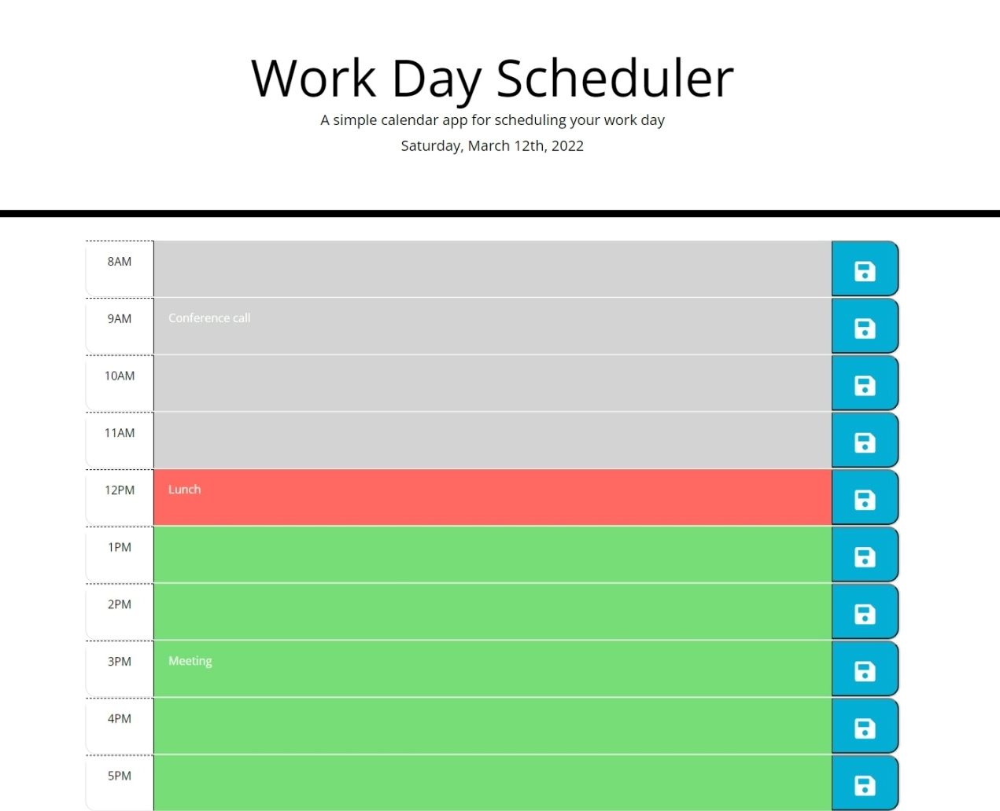

# Work Day Scheduler
## Module 5 challenge

### Purpose

This is a single day calendar application that allows the user to save their tasks and events for the current day.

The current day and date of the week are displayed at the top of the calendar page. The planner has hourly timeblocks where the user can type in any imporant events they need to remember. The timeblocks are color-coded to indicate whether the time is in the past, present, or future. All  events are saved in local storage.

### Built With

- HTML
- CSS
- Javascript

### Website

https://evelynaguirreortiz.github.io/work-day-scheduler-challenge-utsa-bc-03-2022/

